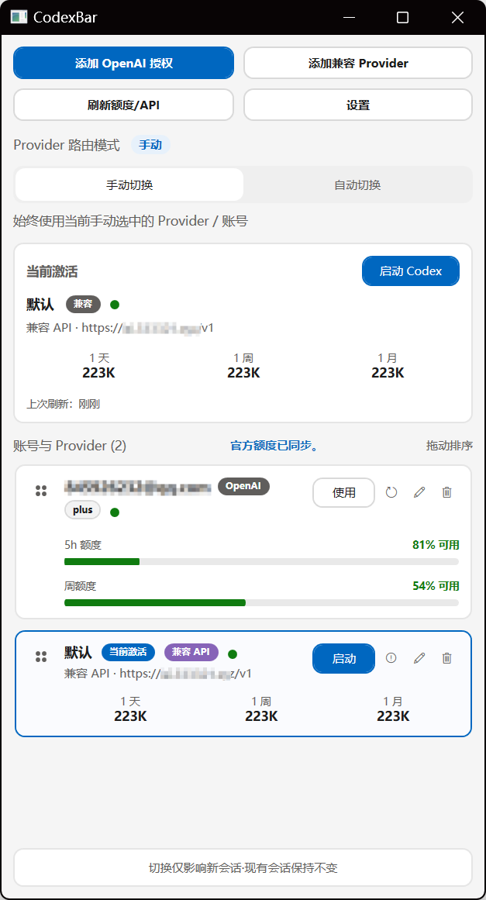
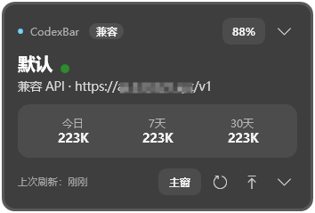
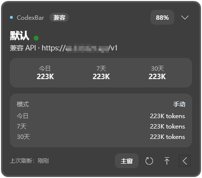

# CodexBar for Windows

当前版本：`v0.2.1`

CodexBar for Windows 是 macOS 项目 [`lizhelang/codexbar`](https://github.com/lizhelang/codexbar) 的 Windows 原生移植版。它的目标不是重做 Codex，而是在 Windows 上提供一个更顺手的账号与 Provider 切换入口，让你在**不拆分本地 `.codex` 历史池**的前提下管理 OpenAI 官方账号和第三方兼容接口。

一句话说明：

**用一个 Windows 托盘工具，安全切换当前激活的 Codex 账号 / Provider，并直接启动 Codex。**

## 适合谁

- 你在 Windows 上使用 Codex Desktop 或 Codex CLI
- 你希望在多个 OpenAI 账号之间快速切换
- 你需要接入 OpenAI-compatible Provider / 第三方 API 中转站
- 你不想为了切账号而拆出多个独立 `~/.codex`

## 界面预览

CodexBar for Windows 的日常交互主要围绕两类界面展开：

- **主浮窗**：集中承载账号 / Provider 管理、启动 Codex、查看当前激活对象与进入设置，是完整的高频操作入口。
- **小浮窗**：作为轻量常驻视图，适合快速确认当前激活的 Provider、usage 摘要和最近刷新状态；展开后还能继续查看更细的 usage 明细与当前模式。

| 主浮窗 | 小浮窗（默认） | 小浮窗（展开） |
| --- | --- | --- |
|  |  |  |

## 核心能力

- 运行形态收敛为“托盘 + 主浮窗 + 独立 Overlay + 独立弹窗”，不把弹窗改成路由页
- 主浮窗已按 Figma 交互层级重建为原生浮窗：顶部动作区、路由切换、当前激活摘要与可拖动账号卡片
- Figma 导出的重建基线仅作为视觉与交互参考，不作为最终 Windows 运行入口
- 管理多个 OpenAI OAuth 账号
- 管理多个 OpenAI-compatible Provider 和多组 API Key
- 切换账号时原子写入 `config.toml` / `auth.json`
- 保持共享 `sessions` / `archived_sessions` 历史池不被拆分
- 查看本地 usage 统计（今日 / 近 7 天 / 近 30 天 / 累计）
- 只读刷新 OpenAI 官方套餐 / 额度信息
- 从 GUI 直接启动 Codex，并在兼容 Provider 场景下注入当前 API Key
- 支持基础托盘交互、设置页、OAuth 登录窗口和兼容 Provider 管理窗口
- 单实例已运行时，`--open` / `--overlay` / `--settings` 会转发到主实例执行

## 兼容性承诺

这是这个项目最重要的行为边界：

- 共用同一个 `CODEX_HOME` / `~/.codex`
- 共用同一个 `sessions` 和 `archived_sessions`
- 切换时只更新当前激活态的 `config.toml` 和 `auth.json`
- 不复制历史、不重写历史、不按账号拆分 `.codex`
- 切换只影响**新启动**的 Codex 会话
- OpenAI OAuth 继续使用外部浏览器 + localhost 回调，并保留手工粘贴 callback URL / `code` 的 fallback

## 快速开始

### 方式一：推荐使用便携包（下载后即用）

如果你只是想直接使用 CodexBar，推荐优先使用便携包。

如果你在本仓库本地打包，请运行：

```powershell
.\package.ps1
```

默认会生成：

- 目录包：`artifacts\package\CodexBar-portable-win-x64-v0.2.1\`
- 压缩包：`artifacts\package\CodexBar-portable-win-x64-v0.2.1.zip`

拿到压缩包后，按下面 3 步即可开始使用：

1. 解压 `CodexBar-portable-win-x64-v0.2.1.zip`
2. 进入解压后的目录
3. 双击 `start-codexbar.cmd`

目录里最常用的两个入口是：

- `start-codexbar.cmd`
- `open-settings.cmd`

说明：

- 便携包内已经带有本地 `.NET` 运行时，不需要额外安装全局 `.NET`
- 首次启动后，CodexBar 会以托盘工具形式常驻；如果没看到主窗口，请留意系统托盘区
- 如果你想先配置账号、Provider 或 Overlay，直接双击 `open-settings.cmd`

### 方式二：从源码直接运行

如果你是开发者或正在本地验证仓库，可以直接运行：

构建：

```powershell
.\build.ps1
```

启动主程序：

```powershell
.\run-win.ps1
```

打开设置：

```powershell
.\run-win.ps1 --settings
```

如果机器已经安装全局 `.NET 8 SDK`，也可以使用：

```powershell
dotnet run --project .\src\CodexBar.Win\CodexBar.Win.csproj
```

## 常见使用方式

### 1. 使用 OpenAI 官方账号

1. 打开设置页
2. 选择登录 OpenAI
3. 在浏览器里完成 OAuth 授权
4. 回到 CodexBar 选择目标账号并激活
5. 从 CodexBar 启动 Codex

如果浏览器回调没有自动完成，也可以继续使用手工粘贴 callback URL / `code` 的 fallback。

### 2. 接入第三方兼容 Provider

在“添加兼容 Provider”窗口中，通常需要填写：

- `Provider ID`
- `Base URL`
- `账号 ID`
- `API Key`

说明：

- `Base URL` 一般填写到 OpenAI 兼容接口根路径，例如 `https://api.example.com/v1`
- 如果不确定地址是否正确，可以在主面板点击“探测 API”
- 切换到兼容 Provider 并从 CodexBar 启动 Codex 时，当前 API Key 会注入到新启动的 Codex 进程
- 为了尽量保持历史会话可见性，兼容 Provider 激活时会尽可能保留现有 OpenAI OAuth 身份快照

### 3. 查看 usage 和套餐信息

当前版本支持：

- 本地 usage 扫描：今日 / 近 7 天 / 近 30 天 / 累计
- OpenAI 官方套餐与剩余额度只读刷新

这些信息更适合帮助你判断当前该切到哪个账号，而不是作为精确计费系统使用。

## 使用注意事项

- **切换只影响新会话。** 已经在运行中的 Codex 进程不会被强行改写。
- **如果 Codex Desktop 已经打开，请先完全退出，再从 CodexBar 启动。** 环境变量只会进入新进程。
- **如果机器没有全局 `.NET`，不要直接双击 `bin` 目录里的 exe。** 优先用便携包里的启动脚本，或使用仓库脚本启动。
- **兼容 Provider 的连通性探测基于 `/models`。** 如果探测失败，先检查 `Base URL` 是否缺少 `/v1`。
- **本地 API 的浏览器访问只信任受控 loopback origin。** 当前只允许 `http://127.0.0.1:5057` / `http://localhost:5057` / `http://127.0.0.1:5173` / `http://localhost:5173` / `http://127.0.0.1:4173` / `http://localhost:4173`；这样保留本地 API 自身和前端重建开发/预览入口，同时阻止任意网页跨站读写本地 API。

## 当前限制

- 还没有 GitHub Releases 更新检测
- 还没有真正的自更新 / 安装器（MSIX / MSI）
- OpenAI 聚合网关目前是激活时路由，不是真正的实时代理
- usage 成本估算仍然是占位方案
- UI 仍以 MVP 可用性优先，后续还会继续整理

## 开发者补充

如果你是来参与开发或查看实现细节，建议直接看：

- 详细变更：`CHANGELOG.md`
- 实现状态：`docs/IMPLEMENTATION_PROGRESS.md`
- 原生窗口迁移说明：`docs/NATIVE_WINDOW_REBUILD.md`
- 协作 / 交接 / 发布规则：`docs/THREAD_WORKFLOW.md`

## 致谢

本项目的 Windows 版本移植工作，基于原始 macOS 项目 [`lizhelang/codexbar`](https://github.com/lizhelang/codexbar) 的产品思路与实现探索推进，在此致谢。

## 版本更新摘要

`README.md` 只保留相对上个版本的简要说明，详细变更请看 `CHANGELOG.md`。

### v0.2.1 - 2026-04-20

- 修复手工 OAuth fallback 成功后旧 `localhost:1455` 监听未及时释放的问题，避免后续登录因端口占用而失败
- 原生 `OAuthDialog` 在手工完成、取消关闭和窗口关闭时都会主动释放 loopback 监听，减少同类端口残留
- 便携包说明改成“下载后即用”口径，解压后直接使用 `start-codexbar.cmd` / `open-settings.cmd` 即可开始使用

## License

This project is licensed under the MIT License. See [LICENSE](LICENSE).
