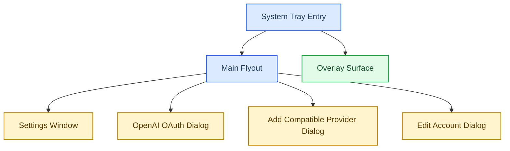

# Frontend Rebuild Start

## Goal

This document defines the starting point for the new frontend rebuild track.

The Figma design and the Figma-pushed frontend repo are the only frontend source of truth for this track:

- GitHub repo: [ZyyoungM/Codexbarforwindowsdesign](https://github.com/ZyyoungM/Codexbarforwindowsdesign)
- Figma file: [CodexBar for Windows Design](https://www.figma.com/design/gPp73veJaeJ9PQfsRPfcBk/CodexBar-for-Windows-Design)

This track does not have permission to redesign the UI, simplify the interaction model into a web dashboard, or convert dialogs into route pages.

## Hard Rules

- `frontend-rebuild/src/app/App.tsx` and `frontend-rebuild/src/app/components/*` are the imported Figma UI baseline.
- Visual hierarchy, spacing, window chrome, and dialog composition must stay faithful to the imported Figma frontend.
- The main surface is the tray-triggered main flyout, not a left navigation page shell.
- Overlay is an independent floating layer, not a route, tab, or inline card in the main flyout.
- `Settings`, `OpenAI OAuth`, `Add Compatible Provider`, and `Edit Account` must remain popup-window/dialog surfaces.
- Account switching behavior must continue to preserve the shared `.codex` history pool and only change active `config.toml` / `auth.json` state for new sessions.
- OpenAI OAuth must keep browser authorization, localhost callback capture, and manual paste fallback.

## Window Hierarchy

## Surface Boundaries

| Surface | Required model | Not allowed |
| --- | --- | --- |
| Main Flyout | Primary tray-triggered desktop flyout | Left-nav dashboard, route shell, settings-home page |
| Overlay | Independent floating overlay with its own compact/expanded states | Normal page, tab inside Settings, section inside Main Flyout |
| Settings | Separate popup window/dialog | Dedicated route page |
| OpenAI OAuth | Separate popup window/dialog | Inline form page replacing browser + callback flow |
| Add Compatible Provider | Separate popup window/dialog | Settings sub-route or embedded accordion-only flow |
| Edit Account | Separate popup window/dialog | Inline edit row or route page |

## Repo Mapping For This Start Point

- `frontend-rebuild/` is the imported Figma frontend baseline inside the main repo.
- `frontend-rebuild/src/app/App.tsx` now acts as the rebuild start shell that preserves the Figma window hierarchy (`MainFlyout` + independent `Overlay` + popup dialogs) while wiring backend APIs.
- `frontend-rebuild/src/app/components/*` are the imported Figma components and should be treated as the first visual reference, not as a place for speculative redesign.
- Future product bootstrapping, native hosting, and data wiring should wrap these imported surfaces instead of rewriting them first.

## What This Change Does Not Do

- It does not implement WebView2 in this round.
- It does not complete every API/host integration detail in this round.
- It does not replace the existing WPF MVP shell in this round.
- It does not authorize converting the product into a generic browser-style backend UI.

## Reserved Future Boundary

If the main thread later decides to host these surfaces through a native shell such as WPF plus WebView2, that host layer may only do window hosting, lifecycle, and data injection.

It may not:

- collapse popup windows into route pages
- turn the overlay into a normal page
- replace the tray-first interaction model with a web dashboard shell
