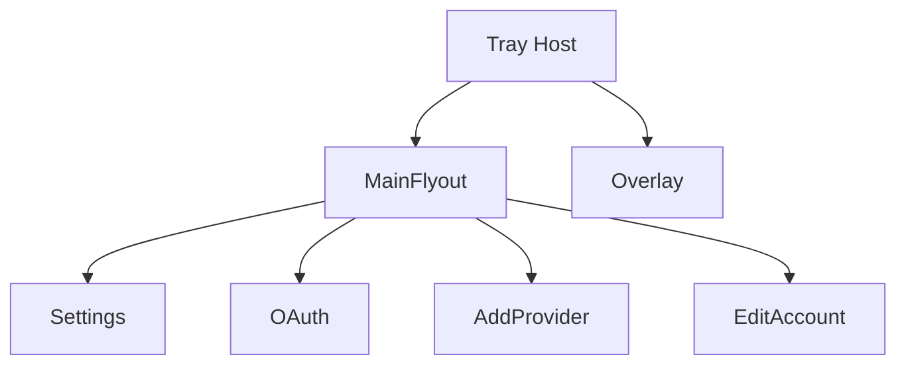

# Native Window Rebuild

Last updated: 2026-04-20

## Purpose

This document defines the Windows-native runtime model for the current feature thread.

The product runtime must converge to:

- tray host
- main flyout
- independent overlay
- independent popup windows

It must not drift into a browser-style backend shell, route-page popup replacement, or a left-navigation web dashboard.

## Source Of Truth

This rebuild uses the following references in order:

1. `AGENTS.md`
2. existing WPF window shell in `src/CodexBar.Win/`
3. imported Figma visual hierarchy and interaction model

The Figma rebuild track remains a visual reference and interaction baseline only. It is not the final product runtime entrypoint for Windows in this candidate.

## Window Hierarchy

## Surface Responsibilities

| Surface | Role | Required behavior | Not allowed |
| --- | --- | --- | --- |
| `MainFlyout` | Primary tray-triggered account and provider switcher | Shows active account summary, routing state, account list, launch/switch/edit actions | Web dashboard shell, left-nav page, route container |
| `Overlay` | Independent floating always-available usage surface | Own window, compact/expanded states, quick refresh, quick launch, lightweight active-account summary | Tab inside Settings, section embedded into main flyout, route page |
| `Settings` | Separate popup window for app-level preferences | Paths, launch behavior, startup, CSV, OpenAI mode settings | Main page replacement, route home |
| `OAuth` | Separate popup window for OpenAI login | External browser auth, localhost callback capture, manual paste fallback | Inline login page or route flow |
| `AddProvider` | Separate popup window for compatible provider creation | Collect provider/account/api key inputs without changing history semantics | Accordion hidden inside settings, sub-route |
| `EditAccount` | Separate popup window for account metadata editing | Updates future activation metadata only | Inline row edit, route page |

## Interaction Rules

The following interactions must stay as independent popup surfaces:

- `Settings`
- `OAuth`
- `AddProvider`
- `EditAccount`

The following interaction must stay as a separate floating window:

- `Overlay`

The following interactions must never be route-ified:

- popup forms above
- tray-open main flyout
- overlay compact/expanded states

Single-instance startup behavior must follow the same native window model:

- `--open` opens or focuses the main flyout
- `--overlay` opens or focuses the independent overlay
- `--settings` opens or focuses the settings popup
- `--tray-only` remains a cold-start / startup-registration path rather than a forwarded window command

## Native Shell Boundary

`CodexBar.Win` is responsible for:

- tray lifecycle
- window creation and ownership
- window positioning
- shared view-model wiring
- direct user interaction flow

It is not allowed to rewrite the core activation/auth/history semantics.

## Service Boundary

Existing backend services remain the semantic source of truth:

- `AppConfigStore`: app-local settings and account metadata
- `CodexActivationService`: writes active `config.toml` and `auth.json`
- `CodexStateTransaction`: protects activation writes
- `UsageScanner` + `UsageAttributionService`: reads shared usage from `sessions` and `archived_sessions`
- `OpenAIOAuthClient` + `LoopbackCallbackServer`: browser auth, localhost callback, manual fallback
- `OpenAiAggregateGatewayService`: activation-time OpenAI routing
- `CompatibleProviderProbeService`: connectivity checks

The native window rebuild may rewire these services into different windows, but it may not:

- split the shared `~/.codex` history pool
- rewrite historical `sessions` or `archived_sessions`
- change switching to affect old sessions
- replace browser OAuth with an embedded-only flow

## Implementation Mapping In This Round

This round keeps the runtime native inside `src/CodexBar.Win/` and maps the surface model like this:

- `App.xaml.cs`: tray host and window coordinator
- `FlyoutWindow.xaml`: current native implementation of `MainFlyout`
- `OverlayWindow.xaml`: new native implementation of `Overlay`
- `SettingsWindow.xaml`: separate popup `Settings`
- `OAuthDialog.xaml`: separate popup `OAuth`
- `AddCompatibleWindow.xaml`: separate popup `AddProvider`
- `EditAccountWindow.xaml`: separate popup `EditAccount`

## MVP Scope For This Thread

Required in this thread:

- explicit native window hierarchy
- shared main/overlay state source
- owned popup-window relationships
- tray entry for main flyout and overlay
- no route-page substitution

Out of scope for this thread:

- WebView2 host replacement
- merging old `codex-frontend-shell-alignment`
- turning the Figma rebuild track into the Windows runtime entry

## Verification Focus

The direct verification target for this round is:

1. build succeeds
2. tray app starts
3. main flyout and overlay can be opened as separate windows
4. popup windows still work from the native shell
5. OAuth/browser/history compatibility rules remain unchanged
